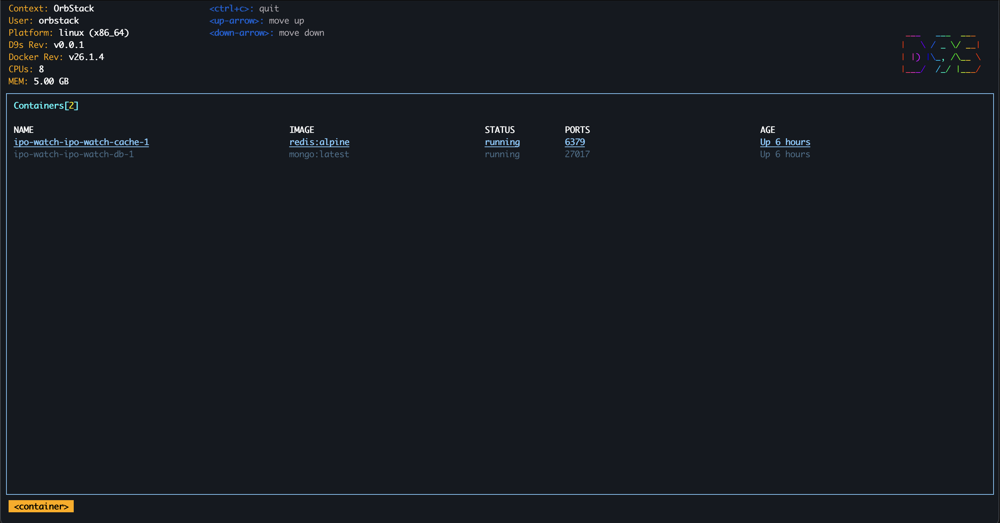

    
# D9s - Docker CLI To Manage Your Containers In Style!

D9s provides a terminal UI to interact with your Docker containers. The aim of this project is to make it easier to navigate, observe and manage your applications in the wild. D9s continuously watches Docker for changes and offers subsequent commands to interact with your observed resources.

Think of it as K9s for Docker!

# Contributing to d9s

We welcome contributions from everyone! Whether you're fixing bugs, improving documentation, or adding new features, your help is appreciated.

**Note:** Before starting work on a new task, make sure to **create an issue** in this repository to keep the everyone updated.

## Getting Started

1. **Fork the Repository**: Click the "Fork" button to create a copy of the repository in your GitHub account.
2. **Clone Your Fork**: Clone your forked repository to your local machine.
3. **Create a Branch**: Create a new branch for your feature or bugfix.
4. **Make Changes**: Implement your changes, ensuring they align with the project's coding style.
5. **Test Your Changes**: Run all tests to ensure your changes do not break existing functionality.
6. **Submit a Pull Request**: Push your changes to your forked repository and create a pull request (PR) to the `main` branch of this repository.

## Guidelines

- Follow the existing code style and conventions.
- Write clear commit messages.
- Provide detailed descriptions for your pull requests.
- Be respectful in all communications.

Thank you for contributing to d9s!
